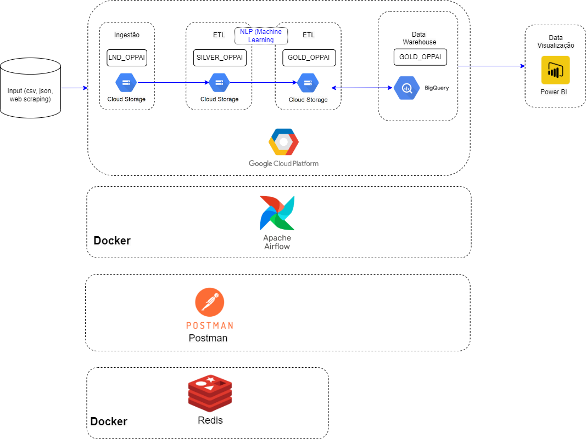
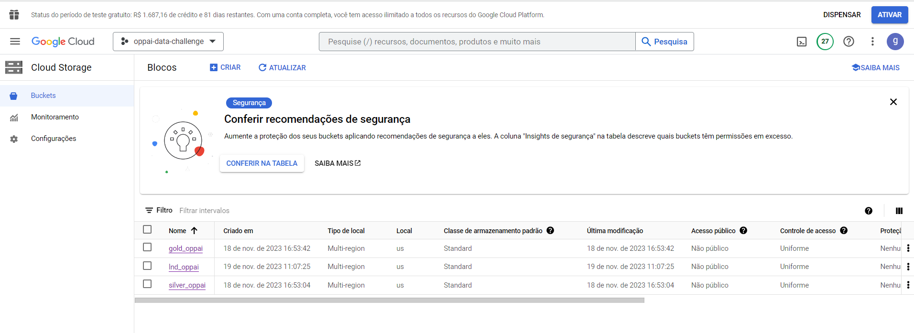
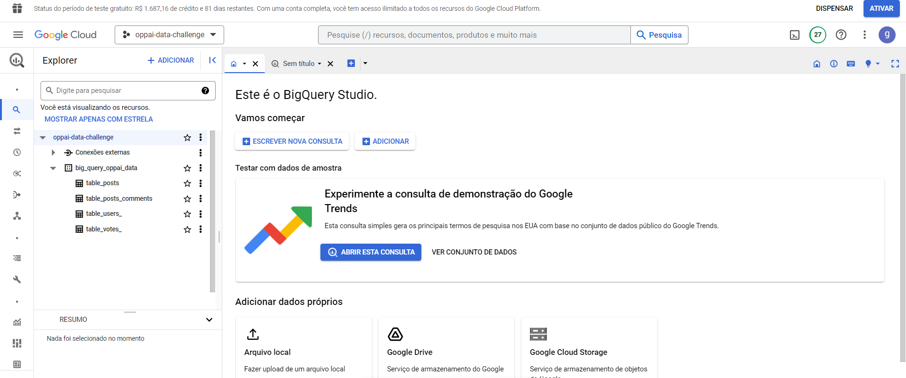
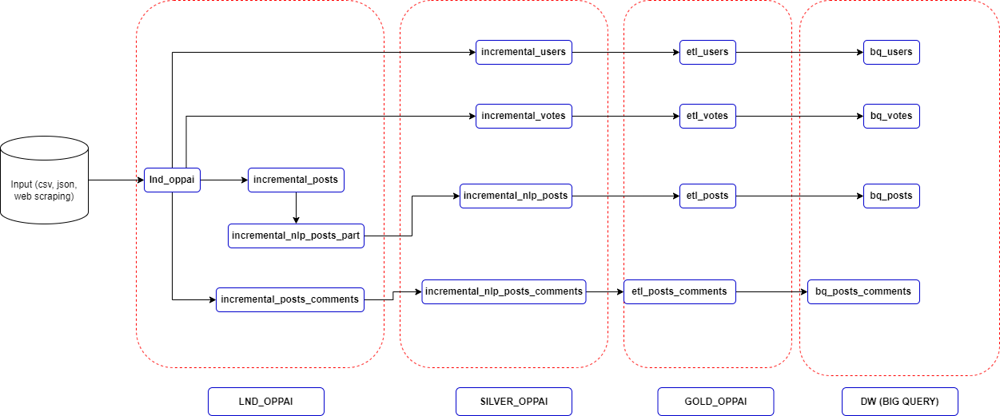
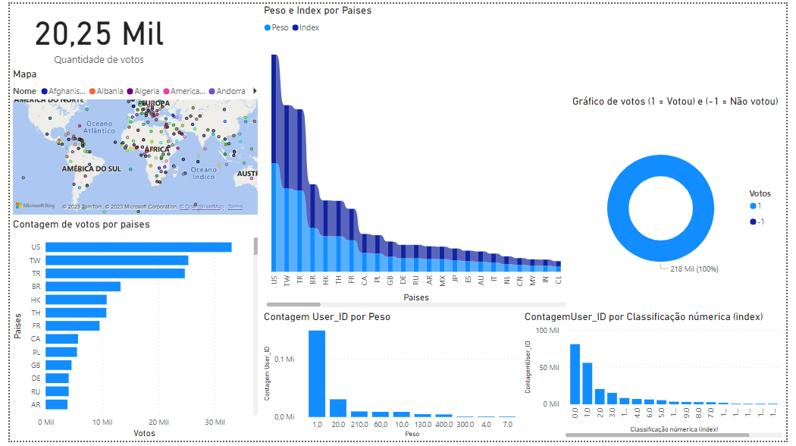
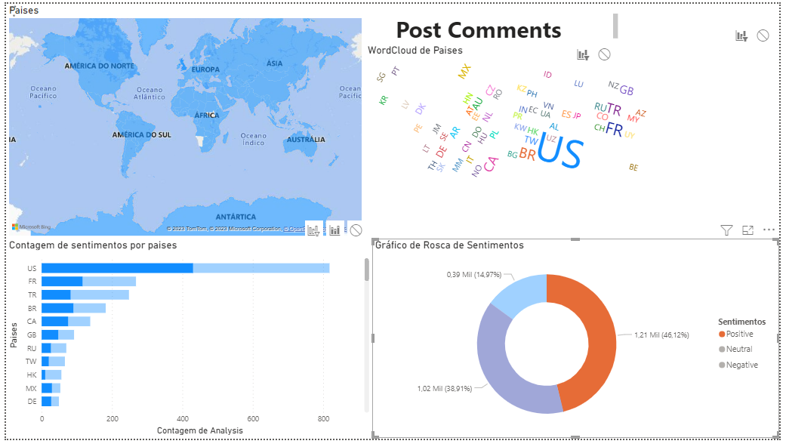
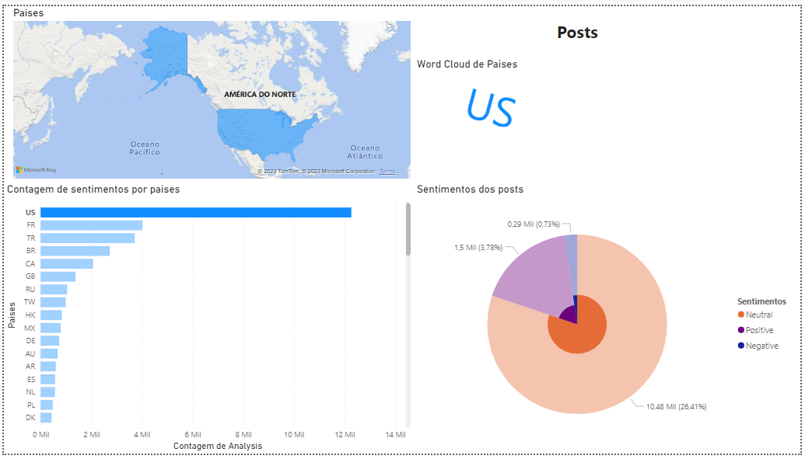

# Analista_Dados_Oppai
# Relatorios_Oppai.docx contém explicações mais detalhadas sobre cada passo feito nesse projeto
# (https://github.com/zng489/Analista_Dados_Oppai/blob/main/Relatorios_Oppai.docx)
# Chave para acesso ao DataLake (https://github.com/zng489/Analista_Dados_Oppai/blob/main/airflow_2.2.0/dags/oppai-data-challenge-9d987fd8259c.json) expira em 30 dias

# Explicação e entendimento das implementações feitas:
#### Criação da arquitetura dentro do ambiente Google Cloud.
#### Utilizou-se Cloud Storage como os buckets de ingestão e de ETL.
#### Utilização do Big Query como DW (Data Warehouse) -  No ambiente Big Query usa-se SQL, assim caso seja necessário poderá criar as Views ou fazer joins entre tabelas Fatos e Dimensionais.
#### Utilização do Python como linguagem principal, no entanto uma boa alternativa seria o PySpark, Dask ou Polars.
#### Arquivos salvos em parquet e csv.
#### Apliacação do NLP (Processamento de Linguagem Natural) - Rodou-se um algoritimo da qual retorno tipos de sentimentos baseado nos tipos de comentários (Primeiramente foi feito uma transformação para a língua inglesa, devido a biblioteca utilizada).
#### Utilização do Airflow para orquestrar os Dags dos pipelines.
#### Utilização do Postman para caso seja necessário ativar os pipelines por meio de API do AirFlow.
#### Utilização do Redis - A utilização do Redis é uma alternativa viável para a incrementação dos dados futuramente, pois visando o a gravação das 'Datas' na memórias, tornaria o processo mais rápido.
#### Utilização do Power BI para a visualização (Foi feito a conexão do Power BI no Big Query - as conexões pode ser to tipo direct ou import).
#### A implementação das incrementais ocorre de acordo com a difereça de ‘datatime’, ou seja, durante a ingestão sempre será acrescentado apenas os dados com datas novos.
#### Outro método a ser utilizado seria a gravação de data mais recente dentro do Redis, da qual serviria para o mesmo propósito.
#### Foi criado duas pastas no Dag do Airflow Anexos_simulando_novos_Files e Anexos para simular esse processo de incrementação.

## A arquitetura do Datalake proposta:

### Camadas LND, Silver e Gold no GCP:

### Data Warehouse - BIG QUERY:

## Workflow da ingestão e do ETL até DW:

## Painéis do Power BI:

